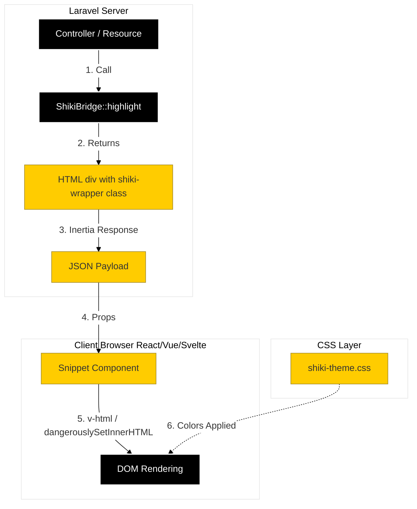

# Laravel Shiki Bridge

[](https://packagist.org/packages/s-a-c/laravel-shiki-bridge)
[](https://github.com/your-username/laravel-shiki-bridge/actions/workflows/run-tests.yml)

**Instant syntax highlighting with zero runtime JS overhead.**

Bridging the high-fidelity themes of [Shiki](https://shiki.style/) with the performance of CSS variables. This package allows you to use VS Code themes in your Laravel application with instant dark mode switching and no hydration issues.

## 🚀 Features

* **Zero Runtime JS:** Syntax highlighting is handled by PHP (server-side) + CSS (client-side).
* **Runtime Agnostic:** Works perfectly with **Node**, **Bun**, **Yarn**, **PNPM**, or **Deno**.
* **Instant Theming:** Switch from Light to Dark mode instantly via CSS classes.
* **Strictly Typed:** 100% Type Coverage, PHPStan Max, and Psalm Strict compliant.

## 📦 Installation

```bash
composer require s-a-c/laravel-shiki-bridge

```

## 🔧 Configuration

### 1. Publish Config & Assets

```bash
php artisan vendor:publish --tag="shiki-bridge-config"
php artisan vendor:publish --tag="shiki-bridge-assets"

```

### 2. Configure Themes

In `config/shiki-bridge.php`, define the themes you want to use.

```php
'themes' => [
    'light' => 'github-light',
    'dark'  => 'github-dark',
],

```

### 3. Generate CSS

Run the build command. This detects your local JS runtime (Bun/Node/Deno), fetches the Shiki themes, and generates the CSS variables.

```bash
php artisan shiki:generate

```

### 4. Load Styles

Add the styles to your layout file (e.g., `resources/views/layouts/app.blade.php`).

```html
<link rel="stylesheet" href="{{ asset('css/shiki-bridge.css') }}">

<link rel="stylesheet" href="{{ asset('css/shiki-theme.css') }}">

```

## 💻 Usage

### Blade Component

Use the provided component to render code blocks.

```html
<x-shiki-code language="php">
class HelloWorld {
    public function say() {
        return "Hello Laravel!";
    }
}
</x-shiki-code>

```

### Tailwind Integration (Optional)

To use theme colors in your UI (e.g., `bg-shiki-bg`), you can use the included plugin.

#### For Tailwind v4 (CSS First)

In your main CSS file (where you import tailwind), use the `@plugin` directive to load the script directly from the vendor folder.

```css
@import "tailwindcss";

/* Load the Shiki Bridge Plugin */
@plugin "../../vendor/s-a-c/laravel-shiki-bridge/resources/js/tailwind-plugin";

```

*Note: Ensure the path is correct relative to your CSS file.*

#### For Tailwind v3 (Config JS)

Add the plugin to your `tailwind.config.js`:

```js
export default {
    plugins: [
        require('./vendor/s-a-c/laravel-shiki-bridge/resources/js/tailwind-plugin')({
            variablePrefix: 'shiki' // Optional
        }),
    ],
};

```

## ⚛️ Usage with Inertia (React / Vue / Svelte)

Since the syntax highlighting generates static HTML classes, you can use it with **any** frontend framework without needing a dedicated JS package.

**1. Highlight in your Controller:**

```php
use Sac\ShikiBridge\ShikiBridge;

public function show()
{
    return inertia('Snippet/Show', [
        'code' => ShikiBridge::highlight("<?php echo 'Hello';", 'php'),
    ]);
}

```

**2. Render in your Component:**

**Vue 3:**

```html
<script setup>
defineProps({ code: String });
</script>

<template>
    <div v-html="code" />
</template>

```

**React:**

```jsx
export default function SnippetShow({ code }) {
    return (
        <div dangerouslySetInnerHTML={{ __html: code }} />
    );
}
```

**Svelte:**

```html
<script>
    export let code;
</script>

<div>{@html code}</div>

```

### Inertia Bridge

This diagram illustrates how the "Inertia Bridge" works. Logic remains on the server; only the styled HTML travels to the client.


